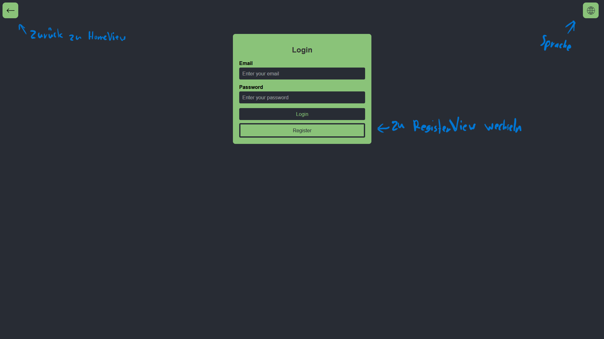
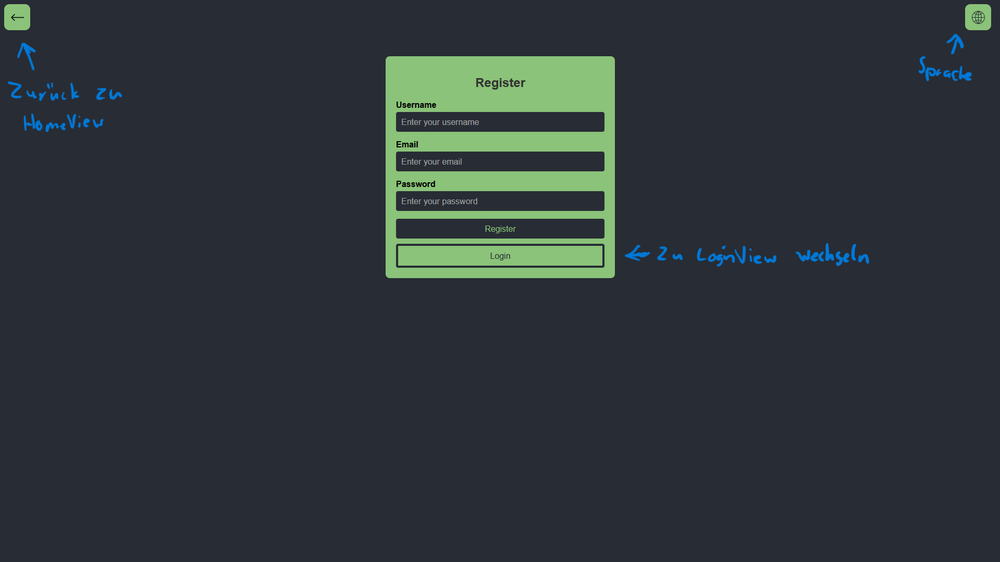
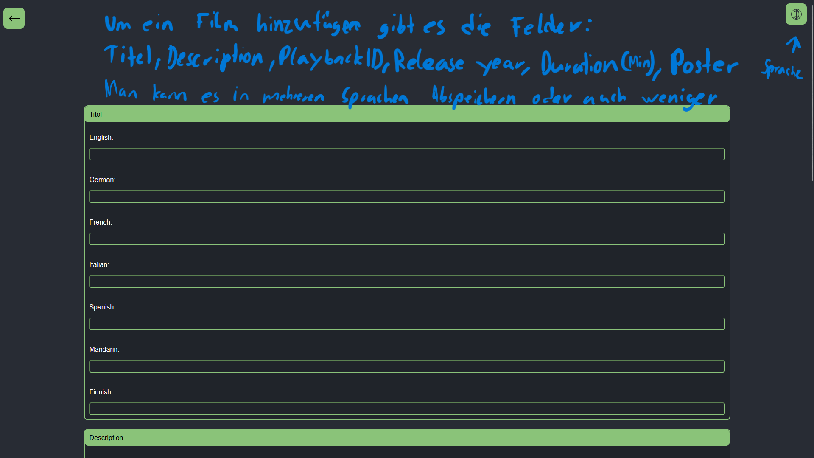

# CineRate

## Inhaltsverzeichnis

1. [Einleitung](#einleitung)
2. [Datenbankdesign](#datenbankdesign)
3. [Implementierung, technische Details, Architektur](#implemetierung)
4. [Installation und Setup](#installation)
5. [Benutzerhandbuch](#benutzerhandbuch)
6. [Pobleme und Lösungen](#probleme)
7. [Zusammenfassung und Ausblick](#zusammenfassung)
8. [Anhang](#anhang)

# Einleiting

## Projektziel
Das Projekt CinaRate wurde hergestellt, um einfach Filme zu bewerten und mit anderen Nutzern zu Diskutieren oder einfach ein Kommentar zurück zu legen. 

## Funktonalitäten
-	Kunde wollte von Funktionen her mit Hierarchie:
o	Für Benutzer 
o	Account erstellen und einloggen,
o	Filme von 1-10 Bewerten,
o	Filmtrailer anschauen,
o	Unter Filme kommentieren,
o	Kommentare löschen,
o	Kommentare bearbeiten,
o	Filmrating bearbeiten ^
###

- 	Für Mods
o	Alle Funktionen wie Benutzer,
o	Kommentare löschen
o	Filme zur Webseite hinzufügen,
o	Filme von der Webseite löschen,
o	Filme bearbeiten,
o	Für Admins 
o	Alle Funktionen wie Mods,
o	Andere Benutzer zu Admins oder Mods machen,
o	Filme Hinzufügen
###
-	Kunde wollte von Design her:
o	Gleichmässige NAVBAR
o	Filme können auf Desktop / Handy gleich gut sehen
o	Konsistenter Aufbau vom Design / Farben
o	Gut ansehbare Farben und einfache Login

# Datenbankdesign
Frag Julius Ceasar

# Implementierung, technische Details, Architektur

## Frontend
Unser User Interface ist modern, funktional und international benutzerfreundlich gestaltet.

Alle Textelemente im Interface sind i18n-fähig und können in verschiedene Sprachen übersetzt werden. Platzhalter, Button-Texte, Hinweise und Fehlermeldungen sind sprachneutral aufgebaut und flexibel anpassbar.

Das Login-Formular ist zentral positioniert und visuell klar hervorgehoben. Es enthält Eingabefelder für E-Mail und Passwort sowie eine Option zur Registrierung, falls noch kein Konto besteht. Der grüne Farbakzent hebt zentrale Funktionen hervor und sorgt für konsistente visuelle Führung – unabhängig von der Sprache.

Auf allen Views gibt es oben rechts ein Dropdown für die verschiedenen Sprachen. (Englisch, **Deutsch**, Itailienisch, Spannisch, Chinesisch und Finnisch)

Die „Film hinzufügen“-Funktion ist über den grünen Button oben links erreichbar. Berechtigte Nutzer (z. B. Admins) können Filme mit Titel, Erscheinungsjahr, Dauer und Bild hochladen. Alle Eingabefelder verwenden internationalisierbare Labels und Validierungsnachrichten.

In der Detailansicht eines Films („MovieView“) ist eine übersichtliche Kommentarfunktion integriert. Nutzer können Bewertungen und Kommentare abgeben sowie Rückmeldungen anderer sehen – alle Textbausteine sind auf Mehrsprachigkeit ausgelegt.

## Backend

Technologien:
Wir verwenden MariaDB als Datenbank und Express für die Serverlogik.

Serverlogik:
Die gesamte Backend-Logik ist in einem separaten Repository namens Cinerate Backend organisiert. Dieses Backend wird über API-Routen mit dem Hauptprojekt verbunden.

API-Routen:
Alle GET- und POST-Anfragen werden an das Cinerate-Backend weitergeleitet, das im Backend-Repository definiert ist.

## Datenbankintegrationen

Das Frontend kommuniziert über GET- und POST-Routen mit dem API-Endpunkt, der auf unserem Cinerate-Backend gehostet wird. Darüber erfolgen auch alle Datenbankabfragen.

## Authentifizierung 

Wir verwenden Passwort-Hashing und Entschlüsselung (Decryption), um die Anmeldedaten sicher zu speichern und zu überprüfen. Da Cinerate eine kostenlose Plattform ohne besonders sensible Daten ist, genügt dieser einfache, aber sichere Ansatz für unsere Zwecke.

## Mehrsprachigkeit
Wir haben i18n als Framework benuzt.
Eine neue Sprache kann in dem i18n.js File eingetragen werden, man muss einfach jedes Wort was man übersetzten will aufschreiben. Wir haben keine Datenbank benuzt. 

# Installation und Setup

- npm install

# Benutzerhandbuch
## Start
- npm run dev
- o
## Screenshots
HomeView:

LoginView:

RegisterView:

MovieView:

AddMovieView: 

## Probleme und Lösungen
# Herausforderungen
Eine der größten Herausforderungen bestand darin, Filminformationen in mehreren Sprachen in der Datenbank zu speichern.
Dies erforderte eine flexible Datenbankstruktur, bei der Titel und Beschreibungen pro Sprache abgelegt werden konnten. Die Lösung bestand darin, die Sprachinhalte als Objekt mit Sprachkennungen zu speichern, um Mehrsprachigkeit effizient zu unterstützen.
# Bekannte Probleme

# Zusammenfassung und Ausblick
• Ergebnisse:
Im Rahmen des Projekts wurden folgende zentrale Funktionen erfolgreich umgesetzt:

Filmtrailer können angesehen werden

Filme können bewertet werden

Bewertungen anderer Benutzer sind sichtbar

Filme können kommentiert werden

Neue Filme lassen sich hinzufügen

Es gibt eine Benutzerhierarchie mit den Rollen: Admin, Moderator und Benutzer

Login- und Registrierungsfunktionen sind implementiert

• Weiterentwicklung:
Für zukünftige Versionen wären folgende Erweiterungen denkbar:

Such- und Filterfunktionen für Filme

Verbesserte Moderationstools (z. B. Kommentarverwaltung)

Möglichkeit, Benutzerprofile individuell zu gestalten

Favoriten- oder Watchlist-Funktion

E-Mail-Benachrichtigungen bei neuen Kommentaren oder Bewertungen

# Anhang

## Quellcode
https://github.com/julianamschwand/CineRate.git

## Ressourcen

